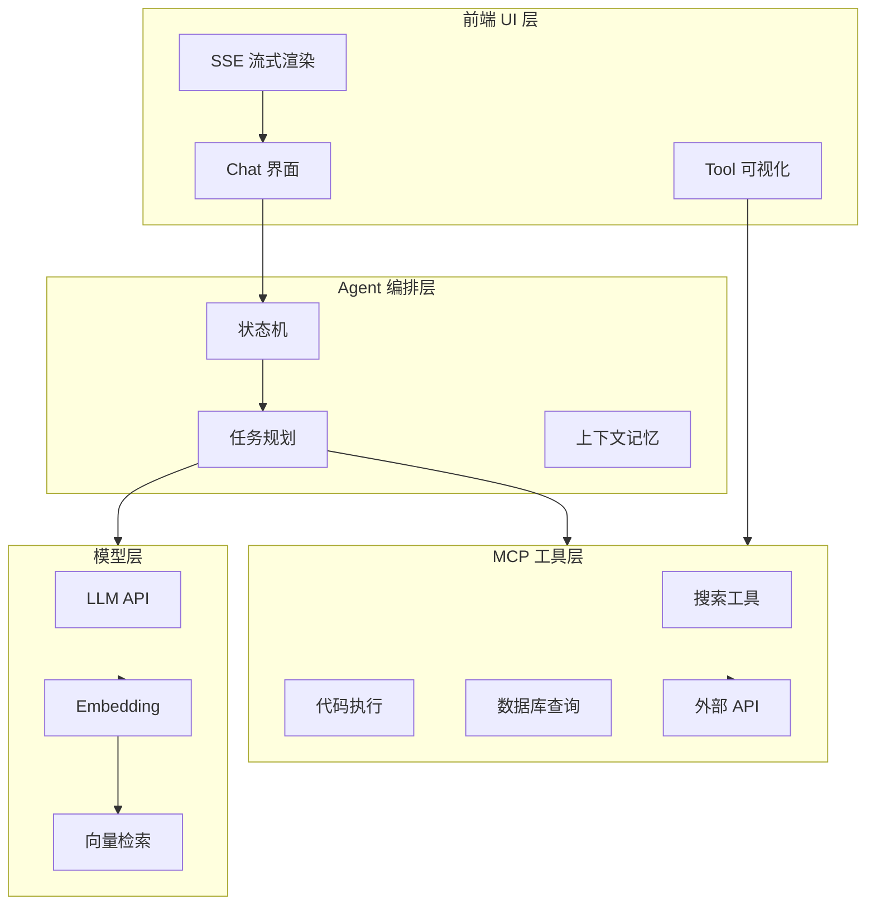

AI 应用从 Demo 到生产，差距在**工程化**：MCP 工具协议、Agent 编排、Prompt 管理、监控降级，缺一不可。

## AI 应用工程架构



## MCP 协议核心

MCP（Model Context Protocol）定义了 LLM 与外部工具的标准通信：

```ts
type MCPTool = {
  name: string;
  description: string;
  inputSchema: JSONSchema;
  handler: (params: unknown) => Promise<unknown>;
};

const tools: MCPTool[] = [
  {
    name: "search_docs",
    description: "搜索内部文档库",
    inputSchema: { type: "object", properties: { query: { type: "string" } } },
    handler: async ({ query }) => vectorSearch(query),
  },
];
```

## Agent 状态机

```ts
type AgentState = "idle" | "planning" | "tool_calling" | "generating" | "error";

const transitions: Record<AgentState, AgentState[]> = {
  idle: ["planning"],
  planning: ["tool_calling", "generating"],
  tool_calling: ["planning", "generating", "error"],
  generating: ["idle", "error"],
  error: ["idle"],
};
```

## Prompt 版本管理

| 实践     | 说明                                |
| -------- | ----------------------------------- |
| 模板化   | `{{context}}` + `{{question}}` 占位 |
| 版本号   | v1.2.0 对应模型和评测分数           |
| A/B 测试 | 10% 流量走新 Prompt                 |
| 评测集   | 50+ 标准问答对自动评分              |

## 生产级 checklist

- [ ] 流式响应 + 中断/重试
- [ ] Token 用量监控与成本告警
- [ ] 模型降级（GPT-4 → GPT-3.5 → 本地）
- [ ] 敏感词过滤 + 输出审核
- [ ] 用户反馈闭环（👍/👎 → Prompt 迭代）

## 系列预告

- RAG 管线从前端到后端
- AI 应用监控与成本治理
- 本地模型部署与边缘推理
