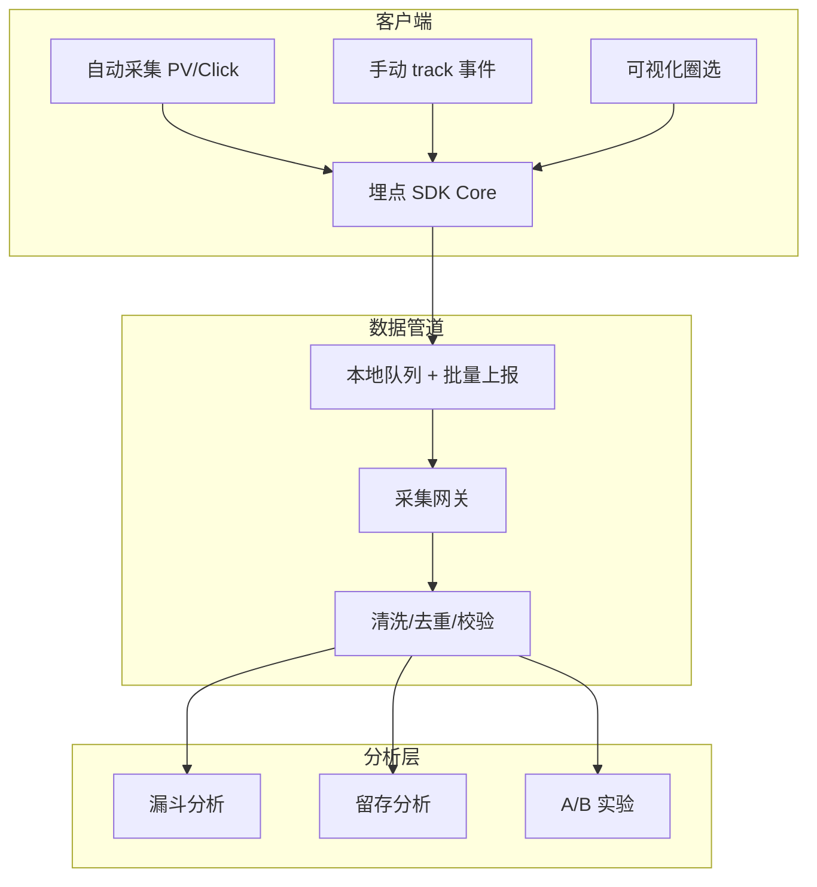

埋点不是「加一行代码」，而是一套**从规范 → SDK → 治理 → 分析**的数据工程体系。这篇作为「数据埋点与增长」专题开篇，给出可落地的 SDK 架构。

## 埋点体系架构



## 事件命名规范

```
{业务域}.{页面}.{动作}.{对象}

示例：
- commerce.product.click_add_cart
- user.login.success
- ai.chat.send_message
```

| 字段       | 类型   | 必填 | 说明       |
| ---------- | ------ | ---- | ---------- |
| event      | string | ✅   | 事件名     |
| timestamp  | number | ✅   | 客户端时间 |
| user_id    | string | ✅   | 用户标识   |
| session_id | string | ✅   | 会话标识   |
| properties | object | ❌   | 业务属性   |

## SDK 核心设计

```ts
class TrackingSDK {
  private queue: Event[] = [];
  private timer: ReturnType<typeof setInterval> | null = null;

  track(event: string, properties?: Record<string, unknown>) {
    this.queue.push({
      event,
      timestamp: Date.now(),
      user_id: this.getUserId(),
      session_id: this.getSessionId(),
      properties: { ...this.getCommonProps(), ...properties },
    });
    if (this.queue.length >= 20) this.flush();
  }

  async flush() {
    if (this.queue.length === 0) return;
    const batch = this.queue.splice(0, 50);
    try {
      await fetch("/api/track/batch", {
        method: "POST",
        body: JSON.stringify(batch),
        keepalive: true,
      });
    } catch {
      this.queue.unshift(...batch);
    }
  }
}
```

## 三种采集模式

| 模式       | 适用         | 优点     | 缺点     |
| ---------- | ------------ | -------- | -------- |
| 自动采集   | PV、点击热区 | 零代码   | 粒度粗   |
| 手动埋点   | 关键转化     | 精确     | 维护成本 |
| 可视化圈选 | 快速迭代     | 运营友好 | 易混乱   |

## 数据治理

1. **Schema 校验**：上报前校验必填字段和类型
2. **去重**：event_id + timestamp 去重
3. **采样**：高频事件 10% 采样
4. **隐私**：PII 字段哈希或不上报

## 系列预告

- 漏斗分析与留存模型
- A/B 实验前端 SDK
- 隐私合规与 GDPR 实践
