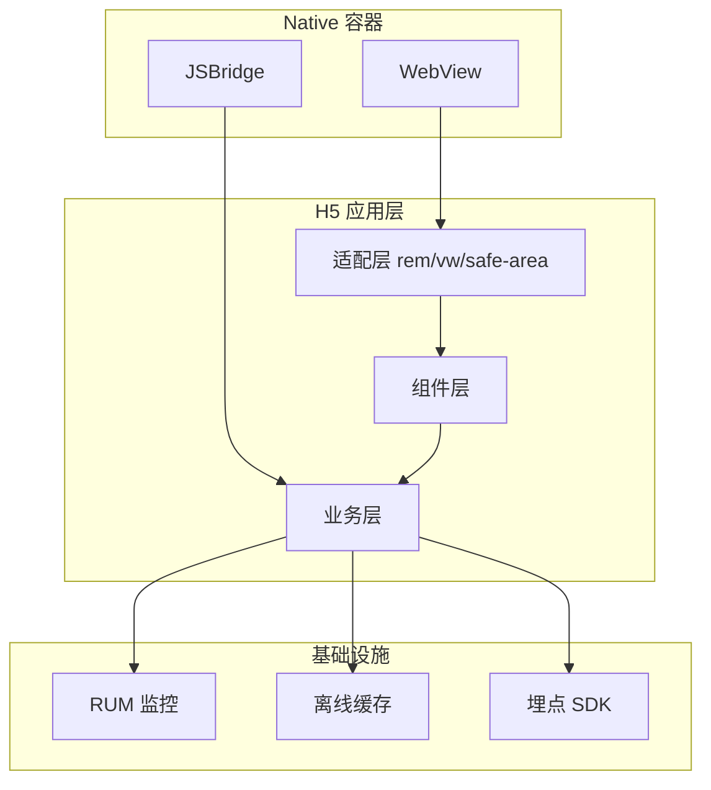

移动端 H5 的核心挑战不是「能不能显示」，而是**在不同 DPR、不同 WebView、不同键盘行为下保持一致体验**。这篇作为「移动端 H5 与适配」专题的开篇，给出可落地的架构分层。

## 整体架构



## 适配方案选型

| 方案                    | 原理       | 适用场景            | 风险           |
| ----------------------- | ---------- | ------------------- | -------------- |
| rem + flexible          | 动态根字号 | 传统 H5、设计稿 750 | 大屏字体过大   |
| vw/vh                   | 视口比例   | 活动页、全屏        | 横屏需额外处理 |
| clamp + container query | 流体排版   | 现代浏览器          | 兼容性需降级   |

推荐**基础 rem + 关键区块 vw** 的混合策略：全局用 rem 保证可读性，Banner/Hero 用 vw 铺满。

## 1px 边框与 DPR

```css
.hairline {
  position: relative;
}
.hairline::after {
  content: "";
  position: absolute;
  inset: 0;
  border-bottom: 1px solid var(--line);
  transform: scaleY(0.5);
  transform-origin: 0 100%;
  pointer-events: none;
}
@media (-webkit-min-device-pixel-ratio: 3) {
  .hairline::after {
    transform: scaleY(0.333);
  }
}
```

## 软键盘与滚动穿透

iOS WebView 中 `position: fixed` 在键盘弹起时容易错位。工程化方案：

1. 输入框聚焦时切换为 `absolute` 布局或滚动容器
2. 使用 `visualViewport` API 监听键盘高度
3. 弹层场景用 `touch-action: none` + 独立滚动容器

## JSBridge 协议设计

```ts
type BridgeMessage = {
  id: string;
  module: "user" | "pay" | "share" | "nav";
  action: string;
  payload?: Record<string, unknown>;
};

async function callNative<T>(msg: BridgeMessage): Promise<T> {
  return new Promise((resolve, reject) => {
    const callbackName = `__cb_${msg.id}`;
    (window as any)[callbackName] = (result: T) => {
      delete (window as any)[callbackName];
      resolve(result);
    };
    window.webkit?.messageHandlers?.bridge?.postMessage?.(msg) ??
      window.AndroidBridge?.invoke(JSON.stringify(msg));
    setTimeout(() => reject(new Error("bridge timeout")), 8000);
  });
}
```

## 性能预算

| 指标    | 目标          | 说明       |
| ------- | ------------- | ---------- |
| FCP     | < 1.8s        | 4G 网络    |
| 首屏 JS | < 120KB gzip  | 活动页更严 |
| 图片    | WebP + 懒加载 | 列表必做   |

## 系列预告

- WebView 容器差异与调试技巧
- H5 离线缓存与预加载策略
- 移动端 RUM 监控接入
