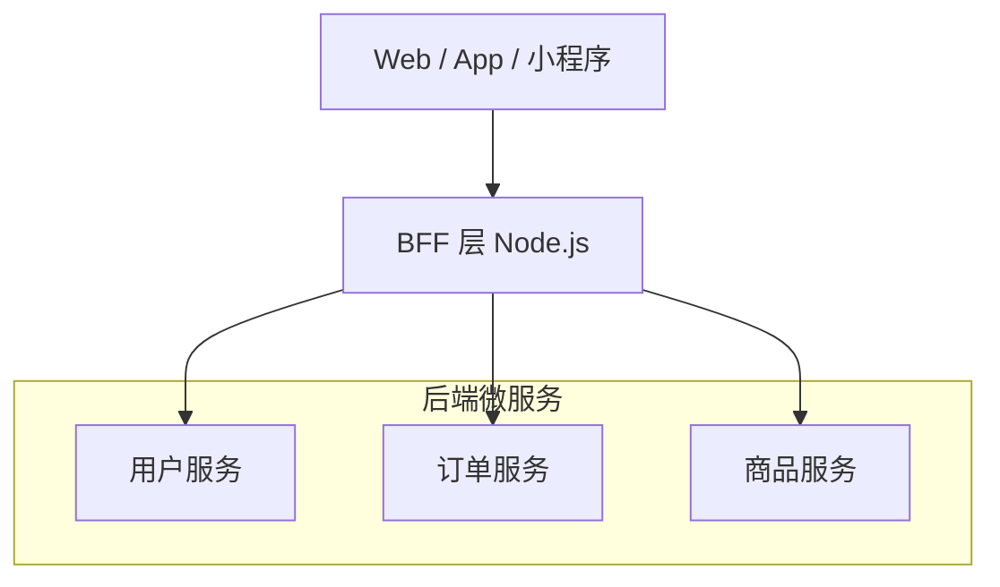

BFF（Backend For Frontend）不是「前端写后端」，而是**让前端团队掌控 API 形态**，在 UI 需求和后端微服务之间建立适配层。

## BFF 在架构中的位置



BFF 的核心价值：**聚合**（一次请求拿多个服务数据）、**裁剪**（按端裁剪字段）、**适配**（统一错误码和鉴权）。

## Koa 中间件模型

```ts
import Koa from "koa";
import Router from "@koa/router";

const app = new Koa();
const router = new Router();

app.use(async (ctx, next) => {
  const start = Date.now();
  try {
    await next();
  } catch (err) {
    ctx.status = err.status ?? 500;
    ctx.body = { code: ctx.status, message: err.message };
  } finally {
    ctx.set("X-Response-Time", `${Date.now() - start}ms`);
  }
});

router.get("/api/dashboard", async (ctx) => {
  const [user, stats, notices] = await Promise.all([
    userService.getProfile(ctx.state.userId),
    statsService.getSummary(ctx.state.userId),
    noticeService.getLatest(5),
  ]);
  ctx.body = { user, stats, notices };
});
```

## API 设计原则

| 原则       | 说明                       |
| ---------- | -------------------------- |
| 按页面聚合 | 一个页面一个 BFF 接口      |
| 字段裁剪   | 移动端少字段，Web 端多字段 |
| 统一错误码 | `{ code, message, data }`  |
| 版本化     | `/api/v1/` 前缀            |
| 超时熔断   | 下游 3s 超时 + 降级        |

## 鉴权中间件

```ts
async function authMiddleware(ctx: Context, next: Next) {
  const token = ctx.headers.authorization?.replace("Bearer ", "");
  if (!token) throw createError(401, "Unauthorized");
  ctx.state.userId = await verifyToken(token);
  await next();
}
```

## 系列预告

- GraphQL BFF vs REST BFF
- Node 服务部署与 PM2/Docker
- BFF 层监控与链路追踪
