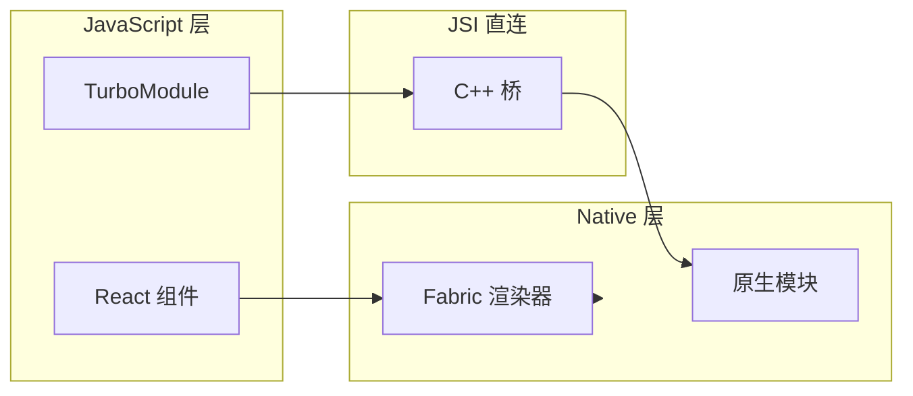

React Native 新架构（New Architecture）用 Fabric + TurboModule + JSI 替换了旧的 Bridge 异步通信，是 RN 性能质变的基础。

## 新架构全景



旧 Bridge 是**异步 JSON 序列化**，JSI 是**同步 C++ 直连**，延迟从毫秒级降到微秒级。

## 性能治理清单

| 场景 | 策略                   | 目标           |
| ---- | ---------------------- | -------------- |
| 启动 | Hermes + 预加载 + 拆包 | TTI < 2s       |
| 列表 | FlashList / 纯 JS 优化 | 60fps 滚动     |
| 图片 | FastImage + 缓存       | 内存可控       |
| 动画 | Reanimated 3 原生驱动  | 不阻塞 JS 线程 |

## 原生模块开发

```objc
// iOS TurboModule 示例（简化）
@interface RCTNativeLocalStorage : NSObject <NativeLocalStorageSpec>
@end

@implementation RCTNativeStorage
RCT_EXPORT_MODULE();

- (NSString *)getItem:(NSString *)key {
  return [[NSUserDefaults standardUserDefaults] stringForKey:key];
}
@end
```

TurboModule 在编译期生成类型安全的接口，避免旧 NativeModule 的运行时反射开销。

## RN vs Flutter 选型

| 维度     | React Native    | Flutter          |
| -------- | --------------- | ---------------- |
| 语言     | JS/TS + 原生    | Dart             |
| 渲染     | 原生组件        | Skia 自绘        |
| 团队成本 | 前端友好        | 学习曲线陡       |
| 生态     | npm 丰富        | pub 增长中       |
| 适用     | 已有 React 团队 | 自绘一致性要求高 |

## 系列预告

- RN 热更新与 CodePush 方案
- Flutter 与 RN 混合开发
- App 内存泄漏排查实战
