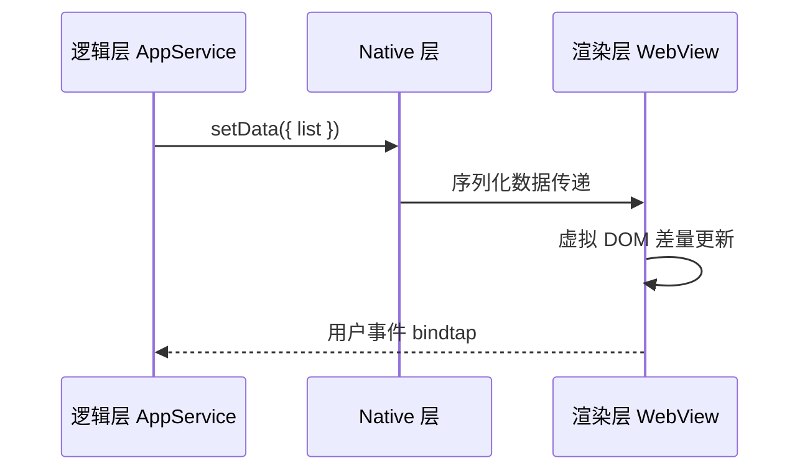

微信小程序的双线程架构（逻辑层 + 渲染层）决定了它的性能模型与 Web 完全不同。理解这套模型，是写出高性能小程序的前提。

## 双线程架构



逻辑层跑在 JSCore，渲染层是独立 WebView，**每次 setData 都是跨进程通信**。这是性能优化的核心约束。

## setData 优化策略

```js
// ❌ 频繁全量更新
this.setData({ list: newList, loading: false, page: 2 });

// ✅ 路径更新 + 合并
this.setData(
  {
    "list[2].title": "新标题",
    loading: false,
  },
  () => {
    /* 回调 */
  },
);

// ✅ 大数据用自定义组件隔离 setData 范围
```

| 策略     | 收益             |
| -------- | ---------------- |
| 路径更新 | 减少序列化体积   |
| 组件隔离 | 缩小 diff 范围   |
| 节流合并 | 避免连续 setData |
| 虚拟列表 | 长列表必做       |

## 分包与预加载

```json
{
  "pages": ["pages/index/index"],
  "subPackages": [{ "root": "packageA", "pages": ["pages/detail/detail"] }],
  "preloadRule": {
    "pages/index/index": {
      "network": "all",
      "packages": ["packageA"]
    }
  }
}
```

主包控制在 **2MB** 以内，按业务域拆分 subPackage，首页预加载高频分包。

## 跨端框架选型

| 框架   | 优势               | 劣势               |
| ------ | ------------------ | ------------------ |
| 原生   | 性能最优、API 最新 | 无法复用 Web 代码  |
| Taro   | React 语法、多端   | 编译层抽象有成本   |
| UniApp | Vue 语法、生态大   | 复杂场景需条件编译 |

## 系列预告

- 小程序登录/支付/订阅消息链路
- Taro 3 编译原理与条件编译
- 小程序监控与错误上报
