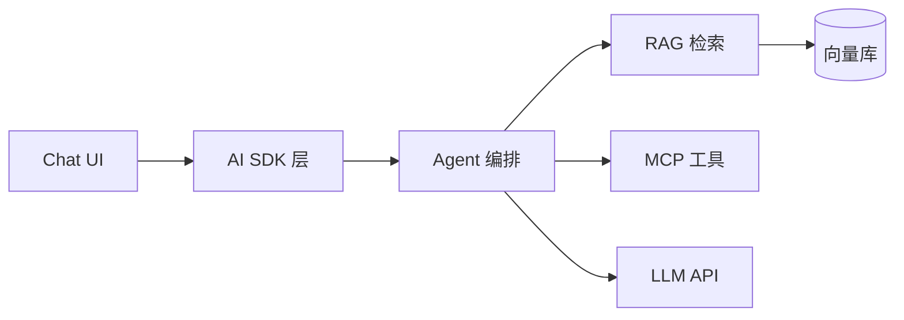

## 项目背景

团队需要一套内部 AI 助手，支持文档问答、代码生成、Tool Calling，日目标 5000+ 对话。

## 核心难点

- 多模型切换（GPT-4 / Claude / 本地模型）的统一抽象
- RAG 检索准确率不足，幻觉问题严重
- 流式 UI 的状态管理（工具调用中间态、多轮上下文）
- Token 成本不可控

## 架构设计

## 关键决策

| 决策     | 方案          | 原因              |
| -------- | ------------- | ----------------- |
| 流式协议 | SSE + AI SDK  | 浏览器兼容好      |
| 检索     | Hybrid Search | 向量 + 关键词互补 |
| 工具协议 | MCP           | 标准化、可扩展    |
| 状态管理 | Agent 状态机  | 多步推理可控      |

## 结果收益

- 日对话量 5200+，P99 延迟 2.3s
- RAG 准确率从 62% 提升到 89%
- Token 成本通过缓存和模型降级降低 40%

## 反思

Prompt 版本管理应该第一天就建立，而不是后期补；评测集是 AI 产品质量的基石。
