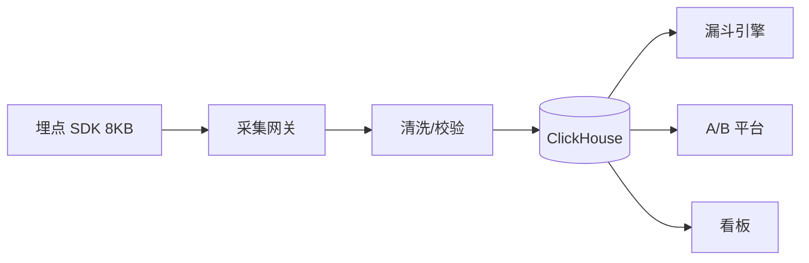

## 项目背景

产品决策依赖数据，但团队缺少统一的埋点规范和分析工具，各业务线自行上报，数据质量参差不齐。

## 核心难点

- 200+ 事件命名混乱，同一行为多种写法
- 上报丢失率高（网络差、页面卸载）
- 漏斗分析需要手动 SQL，产品无法自助
- 隐私合规要求 PII 字段脱敏

## 方案设计

## 关键成果

| 指标         | 前   | 后      |
| ------------ | ---- | ------- |
| 事件规范覆盖 | 30%  | 100%    |
| 上报成功率   | 92%  | 99.5%   |
| 漏斗搭建时间 | 2 天 | 30 分钟 |
| SDK 体积     | 45KB | 8KB     |

## 结果收益

- 产品团队自助搭建 50+ 漏斗
- A/B 实验支撑 3 次关键功能迭代
- 数据驱动决策成为团队标准流程

## 反思

埋点规范应该在第一天就强制执行 Schema 校验，而不是事后清洗；SDK 要足够轻量，否则业务方不愿接入。
