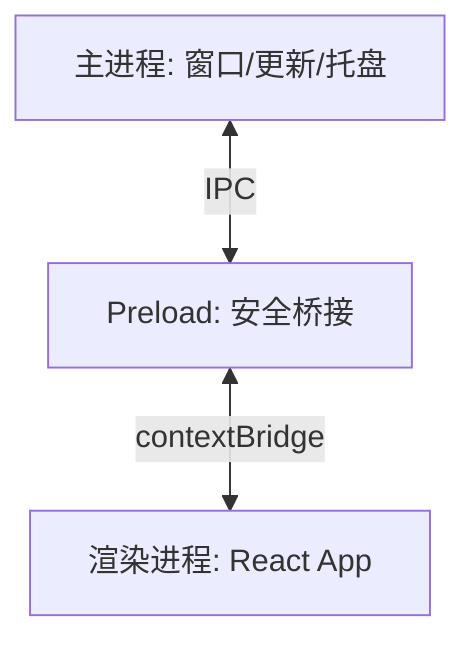

## 项目背景

团队需要将 Web 管理后台封装为桌面客户端，支持 Windows/macOS，离线缓存、系统通知、自动更新。

## 核心难点

- 渲染进程内存泄漏（DevTools 打开 24h 后 800MB+）
- 自动更新的增量下载与回滚
- Vite + Electron 双构建配置
- macOS 公证 + Windows 代码签名

## 架构设计

## 关键优化

| 指标       | 优化前 | 优化后 |
| ---------- | ------ | ------ |
| 冷启动     | 4.2s   | 1.8s   |
| 内存占用   | 800MB  | 280MB  |
| 安装包     | 180MB  | 95MB   |
| 更新成功率 | 85%    | 98%    |

## 结果收益

- 2000+ 内部用户日常使用
- Vite 构建 + electron-builder 多平台 CI 自动化
- Context Isolation + Preload 安全模型零安全事故

## 反思

Electron 的性能问题 80% 在渲染进程，Profiler + 组件卸载治理比换框架更有效。
