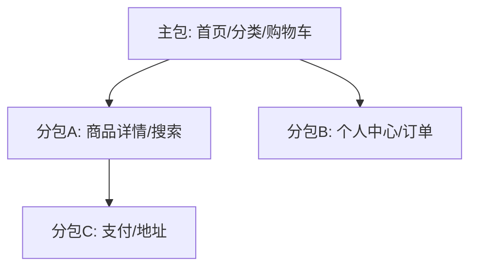

## 项目背景

业务需要从 H5 商城迁移到微信小程序，支持商品浏览、购物车、微信支付，DAU 目标 10 万+。

## 核心难点

- 主包 2MB 限制 vs 功能完整性
- setData 性能导致列表卡顿
- 微信支付 + 登录 + 订阅消息的链路复杂度
- H5 代码复用 vs 小程序原生体验

## 方案设计

## 关键优化

| 优化            | 前    | 后    |
| --------------- | ----- | ----- |
| 主包体积        | 1.9MB | 1.1MB |
| 首屏时间        | 2.8s  | 1.6s  |
| 列表帧率        | 42fps | 58fps |
| setData 次数/秒 | 15    | 3     |

## 结果收益

- DAU 12 万，支付转化率提升 23%
- 列表虚拟滚动 + 组件级 setData 根治卡顿
- Taro 跨端代码复用率 70%

## 反思

小程序的性能模型和 Web 完全不同，不能简单「编译过去」，需要在架构层做组件拆分和 setData 治理。
